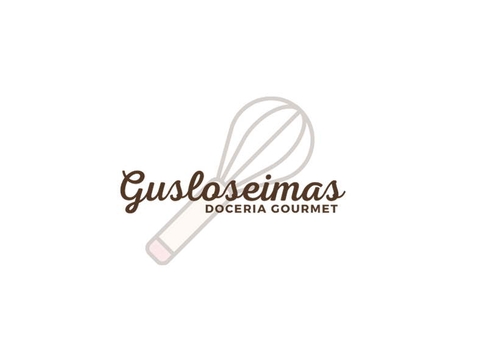

# Gusloseimas 🍪

<p align="center">
  
</p>

<p align="center">
  <b>A loja mais doce da sua vida!</b>
</p>

<p align="center">
  <a href="#sobre">Sobre</a> •
  <a href="#tecnologias">Tecnologias</a> •
  <a href="#funcionalidades">Funcionalidades</a> •
  <a href="#instalação">Instalação</a> •
  <a href="#uso">Uso</a> •
  <a href="#contato">Contato</a>
</p>

## Sobre

Gusloseimas é um site de confeitaria gourmet especializada em cookies e bolos para festas e eventos. Criado por Kátia, mãe do Gus, o negócio nasceu da paixão pela confeitaria e do desejo de levar doçura e felicidade em cada mordida.

Nossa missão é proporcionar experiências gastronômicas únicas através de produtos artesanais de alta qualidade, perfeitos para tornar seus eventos e celebrações ainda mais especiais.

## Tecnologias

Este projeto foi desenvolvido com as seguintes tecnologias:

<p align="center">
  <a href="https://nextjs.org/" target="_blank"></a>
  <a href="https://reactjs.org/" target="_blank"></a>
  <a href="https://tailwindcss.com/" target="_blank"></a>
  <a href="https://heroicons.com/" target="_blank"></a>
  <a href="https://developers.google.com/maps" target="_blank"></a>
  <a href="https://analytics.google.com/" target="_blank"></a>
</p>

## Funcionalidades

- **Catálogo de Produtos**: Exibição detalhada dos cookies e bolos disponíveis
- **Serviços para Festas e Eventos**: Soluções personalizadas para suas celebrações
- **Contato Direto**: Integração com WhatsApp para pedidos rápidos
- **Localização**: Mapa interativo para encontrar nossa loja
- **Responsividade**: Experiência otimizada em dispositivos móveis e desktop

## Instalação

Para instalar e executar este projeto localmente, siga estas etapas:

```bash
# Clone o repositório
git clone https://github.com/seu-usuario/site-gusloseimas.git

# Acesse a pasta do projeto
cd site-gusloseimas

# Instale as dependências
npm install

# Configure as variáveis de ambiente
# Crie um arquivo .env.local na raiz do projeto com:
NEXT_PUBLIC_GA_ID=seu-id-do-google-analytics
KEY=sua-chave-da-api-do-google-maps

# Execute o projeto em modo de desenvolvimento
npm run dev
```

## Uso

Após iniciar o servidor de desenvolvimento, acesse `http://localhost:3000` no seu navegador para visualizar o site.

Para construir a versão de produção:

```bash
npm run build
npm start
```

## Contato

Para encomendas e informações:

- **WhatsApp**: [Fazer pedido](https://api.whatsapp.com/send?phone=5545988214352)
- **Instagram**: [@gusloseimas](https://www.instagram.com/gusloseimas)
- **Facebook**: [gusloseimas.cookies](https://www.facebook.com/gusloseimas.cookies)
- **TikTok**: [@gusloseimas](https://www.tiktok.com/@gusloseimas)

---

<p align="center">
  Desenvolvido com ❤️ por <a href="https://www.7aps.com.br">7APS</a>
</p>